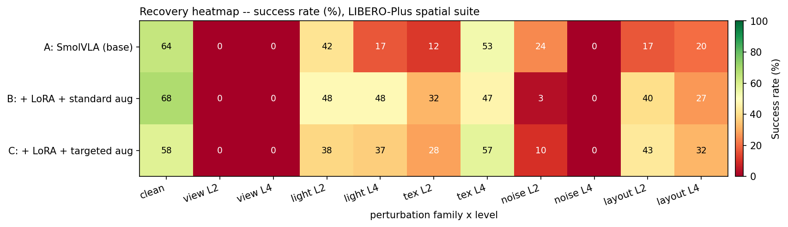

# VLA-Collapse-Recover

[](https://github.com/IntheFesh/project2/actions/workflows/ci.yml)
[](LICENSE)
[](pyproject.toml)

**A reproducible diagnostic of visual-representation quality in open Vision-Language-Action models.**



Open VLAs (SmolVLA) ace clean LIBERO but **collapse** under LIBERO-Plus visual perturbations — a
moved camera, changed lighting, a new texture. This single-GPU, delta-only study reproduces the
collapse and asks one diagnostic question: **does perturbation-targeted LoRA fix the underlying task
representation — so robustness *generalizes to a held-out perturbation family* — or does it only
patch symptoms on the families it was trained on?**

**The collapse (base model, Phase 2).** Base SmolVLA scores **64.0%** clean, then falls off a cliff
under perturbation — the recovery (B/C) is what the heatmap above measures.

| family | clean | L2 | L4 | Δ_robust @ L4 |
|---|:--:|:--:|:--:|:--:|
| viewpoint | 64.0% | 0.0% | 0.0% | **−64.0 pp** |
| lighting | 64.0% | 41.7% | 16.7% | −47.3 pp |
| texture | 64.0% | 11.7% | 53.3% | −10.7 pp |
| noise | 64.0% | 24.4% | 0.0% | **−64.0 pp** |
| layout *(held-out)* | 64.0% | 16.7% | 20.0% | −44.0 pp |

<sub>`texture` L4 > L2 because LIBERO-Plus `difficulty_level` is a heterogeneous task bin, not a linear magnitude.</sub>

---

## Key findings

Three pre-registered, per-episode **paired** tests over a three-condition design — **A** = base,
**B** = LoRA + standard aug, **C** = LoRA + perturbation-targeted aug — on a single seed (1790
trials). Full numbers and reading in **[docs/RESULTS.md](docs/RESULTS.md)**.

| Test | question | ΔSR (95% CI) | significance |
|---|---|---|---|
| **H1** | LoRA + standard aug lifts robustness? (A vs B, pooled, n=540) | **+7.4 pp** [+2.8, +11.9] | McNemar *p* ≈ 0.0018 — **significant** |
| **H2** | targeted aug beats standard aug? (B vs C, per in-dist family, Holm) | lighting **−10.8**, noise +3.3, texture +3.3 | all Holm-*p* > 0.05 — **not rejected** |
| **H3** | the gain reaches a *held-out* family? (A vs B on `layout`, n=120) | **+15.0 pp** [+5.0, +25.0] | McNemar *p* ≈ 0.0072 — **significant** |

- **LoRA improves the task representation, and it transfers** (H1 + H3): the lift reaches `layout`,
  a family **never augmented** in any condition — the signature of a representation-level fix.
- **Augmentation-family-matching gives no systematic advantage** (H2): for every in-distribution
  family, C ≠ B does not survive Holm correction. Augmentation helps; matching the *family* does not.

> **Single seed.** Every ΔSR / *p*-value is *within-seed* paired statistics (LIBERO-Plus
> deterministic init states make episodes matched across conditions). A multi-seed extension is
> future work.

**Negative findings — real conclusions, not bugs:**

- **`viewpoint` stays at 0%** under A, B, and C — the 2-D image-space augmentation proxy
  (RandomPerspective + RandomAffine) **cannot confer 3-D viewpoint invariance**, as flagged up-front
  in `data/augment/visual_aug.py`. A proxy that *should* fail does fail.
- **`noise` gets *worse* after LoRA** — 24.4% (A) → 3.3% (B) / 10.0% (C) at L2: photometric
  augmentation appears to make the policy *more* fragile to sensor noise. An open question we
  **report**, not a result we claim, and not a bug.
- **Condition C's `lighting` underperforms B** (Δ_method = −10.8 pp) — the targeted ±0.4 jitter is
  heavier than B's ±0.2 and hurts; "more targeted" is worse at this magnitude.

## What this contributes

**A diagnostic, not a method.** No new fine-tuning algorithm is claimed; B/C use off-the-shelf
LeRobot augmentation. The contribution is:

1. **A reproducible measurement** of VLA visual-perturbation *collapse* and the *recovery* from
   perturbation-targeted LoRA, on a single RTX 5090 in under a GPU-day.
2. **A diagnostic-probe battery** — held-out cross-family generalization + language-conditioning
   sensitivity — that distinguishes **representation-level fixing from symptom patching**, read
   *through* the A/B/C comparison + paired statistics. Canonical description:
   **[docs/PROBES.md](docs/PROBES.md)**.
3. **Honest negative findings** (above), reported as real conclusions rather than smoothed away.

**The diagnostic logic.** The key read-out is the **generalization gap** = `Recovery_in_dist −
Recovery_held_out`. A *small or negative* gap means the held-out family recovers as much as the
augmented ones → a representation-level fix; a *large positive* gap means the model only patched the
families it trained on → symptom patching. Here the gap is small/negative (H1 ≈ H3), and family
matching adds nothing (H2) — so the recovery is mediated by LoRA's task-representation improvement,
not by augmentation-family-matching.

The paired-statistics machinery (bootstrap CIs, McNemar, Holm–Bonferroni in
[`eval/stats/`](eval/stats/)) is **supporting infrastructure** — shared with the author's prior
project, **PolicyArena** — **not** a headline claim of this repo.

## Experimental design & stack

**Conditions** (differ *only* in the training intervention): **A** base (pretrained
`smolvla_libero`, no fine-tune) · **B** LoRA + standard/default augmentation · **C** LoRA +
augmentation whose family & magnitude mirror the eval perturbations · *(D feature-mod = stretch, not
run here)*.

**Perturbations** (LIBERO-Plus, graded L2/L4): augmented / in-distribution families **{viewpoint,
lighting, texture, noise}**; held-out generalization family **{layout}** — never augmented in any
condition. Pairing is by `(task_id, level)`; all conditions roll out from identical init states, so
every episode is matched and a paired test detects the small B-vs-C gap an unpaired test would miss.

| Role | Choice |
|---|---|
| Base model | **SmolVLA** (~450M) via LeRobot — `HuggingFaceVLA/smolvla_libero` |
| Benchmark · perturbations | **LIBERO** (spatial subset) · **LIBERO-Plus** ([arXiv:2510.13626](https://arxiv.org/abs/2510.13626)) |
| Fine-tuning · augmentation | LoRA/PEFT (r=16, α=32) · torchvision transforms aligned to LIBERO-Plus families |
| Statistics | bootstrap CI · McNemar (paired) · Holm–Bonferroni — *supporting infra, see [PROBES](docs/PROBES.md)* |

## Quickstart

```bash
git clone https://github.com/IntheFesh/project2 vla-collapse-recover && cd vla-collapse-recover
make setup     # off-GPU: uv sync (numpy/scipy/pandas/matplotlib + pytest/ruff); no GPU, no big downloads
make test      # 115 pure-logic tests, all green (no torch / no lerobot required)
make stats     # regenerate analysis/runs/phase5_summary.{md,json} + the heatmap from the committed CSVs
```

`make stats` reproduces the authoritative summary byte-for-byte from the per-episode CSVs. The full
GPU pipeline that *produced* those CSVs (`make smoke → train-B → train-C → eval → stats` on a rented
RTX 5090) is in **[docs/REPRODUCING.md](docs/REPRODUCING.md)**.

## Repository structure

```
vla-collapse-recover/
├── eval/
│   ├── stats/        paired-statistics primitives (bootstrap · paired · holm) + report harness
│   ├── runners/      phase drivers: phase2_collapse · phase4_recovery · phase5_stats · lerobot_runner
│   ├── metrics.py    SR · Δ_robust · recovery · Δ_method · generalization_gap
│   ├── probe.py      language-conditioning probe (paired ΔSR; rollout = GPU seam)
│   └── budget.py     GPU-day budget estimator (gate the matrix before renting)
├── train/            LoRA fine-tune (train_lora) + feature-mod stretch (feature_mod)
├── perturb/          LIBERO-Plus task selection + in-dist/held-out tagging
├── data/             LIBERO subset prep + perturbation-aligned augmentation magnitudes
├── configs/          YAML config: model / lora / perturb / eval
├── analysis/runs/    committed per-episode CSVs + phase5_summary.{md,json} + recovery heatmap
├── docs/             PROBES.md (headline) · RESULTS.md · REPRODUCING.md · EVALUATION.md · LIBERO_PLUS_NOTES.md
├── scripts/          verify_env · estimate_budget · smoke_timing · analyze_results
├── report/           technical_report.md · one_pager.md · results_card.md
├── tests/            off-GPU test suite (115 tests) + fixtures
├── deploy.py         AutoDL-aware one-click GPU deploy
├── Makefile          setup / smoke / train-{B,C} / eval / stats / test / lint
└── run.sh            one-click off-GPU setup / test / verify (+ deploy)
```

## Documentation

| Doc | What |
|---|---|
| **[docs/PROBES.md](docs/PROBES.md)** | the headline diagnostic-probe battery (read this first) |
| **[docs/RESULTS.md](docs/RESULTS.md)** | full results + interpretation + negative findings |
| **[docs/REPRODUCING.md](docs/REPRODUCING.md)** | from a clean clone to `phase5_summary.md` (off-GPU + on-GPU) |
| **[docs/EVALUATION.md](docs/EVALUATION.md)** | statistical conventions (supporting infrastructure) |
| **[docs/LIBERO_PLUS_NOTES.md](docs/LIBERO_PLUS_NOTES.md)** | verified LIBERO-Plus category/level/API specifics |

## Limitations & honest non-claims

- **Diagnostic, not a method** — no new fine-tuning algorithm; B/C use stock LeRobot augmentation.
- **Single seed** — within-seed paired statistics only; no seed-level variance. A 3-seed run on the
  key B/C comparison is the natural extension.
- **Delta-only, in-domain** — a LIBERO-spatial subset on one RTX 5090. **Absolute** success rates
  are **not** comparable to papers and we do **not** claim to reproduce any paper's SOTA; only
  deltas (Δ_robust, Recovery, Δ_method) are reported.
- **In-dist vs held-out is always labeled** — a family seen during augmentation is *in-distribution*;
  one never seen is *held-out generalization*. In-dist recovery is never sold as generalization
  (enforced in code by `classify_distribution`).
- **`viewpoint` augmentation is a 2-D proxy** — a single frame cannot reproduce a moved 3-D camera;
  its failure is itself part of the diagnostic read-out.

## Prior art (cited; no novelty claimed)

- **[arXiv:2510.00037](https://arxiv.org/abs/2510.00037) — "RobustVLA"** — closest prior work, a
  robustness *method*. This repo is a reproducible *study*, not that method (renamed to avoid the clash).
- **[arXiv:2510.13626](https://arxiv.org/abs/2510.13626) — LIBERO-Plus** — the graded perturbation
  benchmark used here as the primary suite.
- **[arXiv:2506.01844](https://arxiv.org/abs/2506.01844) — SmolVLA** — the ~450M base model, chosen
  so the whole study fits a single RTX 5090 in under a GPU-day.
- Conceptual frame: shortcut learning ([arXiv:2004.07780](https://arxiv.org/abs/2004.07780)), causal
  representation learning ([arXiv:2102.11107](https://arxiv.org/abs/2102.11107)), world models
  ([arXiv:1803.10122](https://arxiv.org/abs/1803.10122)). See [docs/PROBES.md](docs/PROBES.md).

## Citation

```bibtex
@misc{vla_collapse_recover_2026,
  title        = {VLA-Collapse-Recover: A Reproducible Diagnostic of Visual-Representation
                  Quality in Open Vision-Language-Action Models under Perturbation},
  author       = {<TODO: author name>},
  year         = {2026},
  howpublished = {\url{https://github.com/IntheFesh/project2}},
  note         = {Version 0.1.0. Single-seed run; per-episode paired statistics}
}
```

See [CITATION.cff](CITATION.cff) (fill in the author placeholder before citing).

## License

MIT — see [LICENSE](LICENSE).
